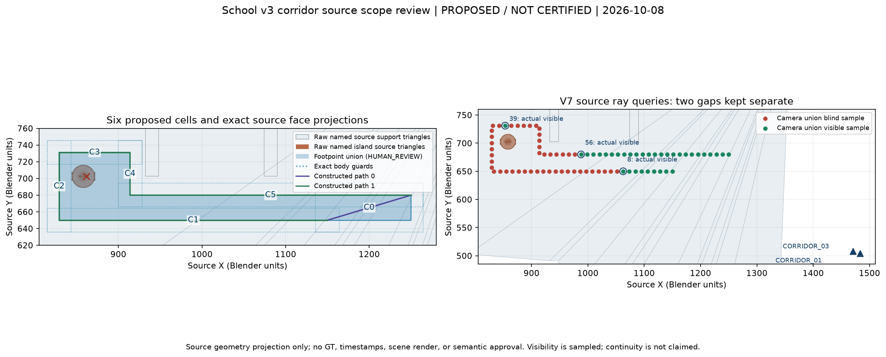

# 1F corridor 局部 source scope review

日期：2026-10-08。狀態：`HUMAN_REVIEW / PROPOSED / NOT_CERTIFIED`。

V7 找到實際來源地面上的六個局部 cell、兩條繞行不同的來源路徑，以及既有相機 union 的真實可見→不可見→可見樣本。這份文件只提出新的 bounded roles；沒有套用 authority、沒有新 certificate PASS，也沒有 Case2 readiness 宣告。既有 office scope、原 human-review decisions 和原 physical policy 保持原樣。

精確待審 [proposal.json](../data/finalization/reviewed_branch_scope_review_v2/proposal.json) 已完成 preparation，scope ID 為 `school-v3-corridor-six-cell-scope-v2`。Canonical content SHA256 是 `7524042121654d399188f52afd2bcfca29effb61287f96eb9f3da2159ddd1bad`；file SHA256 是 `65fa7fa00ae317a2b0039b1690ce42d551e36041858de9aa48b8c2a192dcf641`，bytes `17705`。其 authority 仍是 `HUMAN_REVIEW`、`formal_execution_enabled=false`，沒有新 human receipt applied；preparation 不等於 scope／certificate 核准。見 [source-only request provenance](../data/finalization/reviewed_branch_scope_review_v2/request_provenance.json)。

可直接查看 [診斷摘要](../data/finalization/reviewed_branch_scope_review_v2/source_diagnostic_summary.json)、[來源平面圖](../data/finalization/reviewed_branch_scope_review_v2/source_review_map.png)；完整精度與 source-face arrays 保留在本機 [V7 source proposal](../data/finalization/reviewed_branch_discovery_v7/source_supported_proposal.json)、[實際 source visibility](../data/finalization/reviewed_branch_discovery_v7/source_visibility.json)、[原 source camera calibration](../data/finalization/reviewed_branch_discovery_v7/actual_source_cameras.json) 和 [raw manifest](../data/finalization/reviewed_branch_discovery_v7/manifest.json)。大的 raw evidence 留在本機，不納入 Git。



圖是原 source triangles 的 XY engineering projection；floor 面的延伸只表示來源幾何，沒有把整張投影轉成可行走權限。圖上 cell union、body guards、路徑、相機位置和可見樣本都有原資料對應；沒有 GT、時間排程或 Blender scene render。

## 本次需要審閱的 bounded roles

[DEVELOPMENT_RULES.md 第 30 行](DEVELOPMENT_RULES.md) 明定：「遇到重大場景語意、walkability、camera convention、公開介面、指標或 GT isolation 問題，先停止該不確定部分並詢問；可依既有規格解決的小問題不必擴張設計。」新的來源地面接觸權限、未知 interior 語意和此局部 scope 的相機／landmark 綁定尚未獲授權，因此需要本次具體 review。使用者已批准的 reference MOVING/DWELL policy 不涵蓋這些新的 floor/camera roles，也不需要重新批准 reference policy。

| 待審項目 | 精確範圍 | 明確限制 |
| --- | --- | --- |
| Contact support | `group_0` 下列 28 個 source faces，限六個 cell 與 contact band | 不授予整個 `group_0` WALKABLE；不請求 `group_0.003` 的 support role |
| `group_0/component-00000000` interior | 六個精確 body guards 內無 solid interior | 不更改 guard 外語意；source triangles 仍參與碰撞 |
| `group_0.003/component-00000000` interior | 只限 cells 2、3、4 的 body guards 內無 solid interior | 這些 guard 沒有該 component 的實際 surface intersection；不排除其他 cells 或整個 object |
| Local movement-obstruction surface／witness | 只限原 `trash can01` source face 0（native triangles 0、1）／`component-00000000`；witness 精確來自 triangle 0 | 其他 831 個 `trash can01` faces 與 2936 個 `trash can02` faces 繼續 physical screening；不請求其新 role，不以 collider box 代替 |
| Camera／landmark | 原 `CAM_1F_CORRIDOR_03`、`CAM_1F_CORRIDOR_01` exact calibration，以及此 scope 的 footpoint→marker offset | 相機不移動；不切換 sensor；新 binding 仍是 `HUMAN_REVIEW` |

唯一請求 contact support 的 faces：

```text
1938,1939,1944,1945,1946,1947,1949,1950,1952,1953,1954,1955,1956,1957,
2416,2417,2418,2419,2420,2421,2423,2424,2426,2427,2428,2429,2434,2435
```

原 source 地面 Z 為 `20.07884979248047 BU`，接觸 band 為 `[20.038363962520954, 20.119335622439984] BU`。僅用這 28 個 `group_0` faces 也能支撐兩條 centerlines；對 source union boundary 的最小距離分別是 `100.19745240415382` 和 `82.22519130218296 BU`，大於 required footprint radius `14.170040485829958 BU`。V7 raw 另帶 `group_0.003` 的地面 patch 作診斷，這份 bounded contact request 不需要那些 faces。

## 六個 cell 與完整 body guard

單位均為 BU；`[xmin,ymin,xmax,ymax]` 是 footpoint rectangle。Body guard 的 Z 皆為 `[18.014072464545244,90.96953805158978]`。下表與 [V7 raw 的 `proposed_footpoint_cells`](../data/finalization/reviewed_branch_discovery_v7/source_supported_proposal.json) 一致，JSON 保留完整數值與 source-face intersections。

| Cell | Footpoint rectangle `[xmin,ymin,xmax,ymax]` | Body guard XY `[xmin,ymin,xmax,ymax]` |
| --- | --- | --- |
| 0 | `[1149.9,649.9,1250.1,680.1]` | `[1135.72995951417,635.72995951417,1264.27004048583,694.27004048583]` |
| 1 | `[829.0834304405199,649.9,1150.1,650.1]` | `[814.9133899546899,635.72995951417,1164.27004048583,664.27004048583]` |
| 2 | `[829.0834304405199,649.9,829.28343044052,731.179044637651]` | `[814.9133899546899,635.72995951417,843.45347092635,745.349085123481]` |
| 3 | `[829.0834304405199,730.979044637651,914.1,731.179044637651]` | `[814.9133899546899,716.809004151821,928.27004048583,745.349085123481]` |
| 4 | `[913.9,679.9,914.1,731.179044637651]` | `[899.72995951417,665.72995951417,928.27004048583,745.349085123481]` |
| 5 | `[913.9,679.9,1250.1,680.1]` | `[899.72995951417,665.72995951417,1264.27004048583,694.27004048583]` |

六個 guard 全部被原完整 `BODY:WALK_1F_CORRIDOR_01` source selection 覆蓋；每個 cell 篩檢 22300 source triangles，guard 內只有指定地面 faces。`continuous_body_triangle_sweep_clear=true`，但 `source_body_geometry_clear=false`，原因仍是 `SOURCE_ENCLOSURE_NOT_CLEAR`。這是數值分離與語意 HOLD 的明確區分；沒有省略未知 enclosure。

對同一 `752404…1bad` prepared proposal 的 [實際 strict preview result](../data/finalization/reviewed_branch_scope_review_v2/strict_preview/result.json) 和 [manifest](../data/finalization/reviewed_branch_scope_review_v2/strict_preview/manifest.json) 已完成。六個 cell **全部 `REVIEW`**，第一個保留的 blocker 均為 `group_0/component-00000000` 的 `UNKNOWN_CLOSED_VOLUME_GEOMETRY_UNCERTAIN`，`bounded_surface_semantics_applied=false`。Top-level 是 `HYPOTHETICAL_NUMERIC_NOT_AUTHORITY`，`formal_certificate=null`、`authority_applied=false`、`new_human_approval_exists=false`、`case_readiness=NOT_RUN`。因此原 strict checker 沒有因 proposed profiles 而自動移除未知 interior；raw source triangle-clear、proposal prepared、strict REVIEW 和 formal authority 是四個不同狀態。

原 physical policy 維持 radius `0.3 m`、height `1.7 m`、clearance `0.05 m`、contact tolerance `0.001 m` 和 scale `0.0247 m/BU`。Placement margin `0.5 BU`、tube half-width `0.1 BU` 留下 `0.00988 m` 額外 placement margin；未減少 clearance 或放寬 GJK conservative bound。

`group_0` 的全域 exact-zero-area face count 為 1456，`group_0.003` 為 104。按原 source triangles 的 AABB 對全部六個 body guards 逐一檢查，交集數都為零。因此 **不請求任何 zero-area face exemption**。本次只需審閱上述 bounded no-solid interior；surface collision checks 繼續保留。

Source component 綁定：`group_0` face-set SHA256 `c996710902fecba24866f95deb4f906e3dfba75c0c145c9576749dbdf106b7cd`（17596 faces）；`group_0.003` face-set SHA256 `52ef0d35f8e66cb93113a5365c3dcc6548a346ecf1216056ed0dcbeb28abc985`（1764 faces）。Exact mesh／geometry hashes、component ID、guard coordinates 與完整零面積 IDs 均在 V7 raw 和摘要中。

## Island 的來源面證據

完整 island 幾何仍由下列 named source-face sets 檢查與繪圖。這些 bounds 是原 source-face vertices 的 extrema，沒有用 collider bbox 代替；這兩組完整 face sets 是診斷，不是本次新 role 的授權請求。

| Named source faces | Vertex minima XYZ | Vertex maxima XYZ | Face-set SHA256 |
| --- | --- | --- | --- |
| `trash can01`，832 faces | `[844.1693640947343,688.5162870287894,55.72305703163147]` | `[872.0620812177659,716.409004151821,63.27930474281311]` | `7b7fe60e3bc0c812cd73aeb06c762d2d2ed12eb1574b6fb313ae8c8e1e4de1f8` |
| `trash can02`，2936 faces | `[843.8534709263499,688.9175025820732,20.078834533691406]` | `[872.3779743861501,716.0077903866768,58.96495723724365]` | `977920b792531e23c9cde294f72527082b627b538ca307d5347c4651163be4ae` |

最小新 movement-obstruction witness 選 `trash can01` face 0／triangle 0／`component-00000000`。其 mesh SHA256 為 `cee38bc82b2421e861af0b959d040ea07d1acb14433e1c6b9dced35b25d0237c`，geometry SHA256 為 `9dc36785e045e50411799e5b60c8438cffce19e52401d73992a7bb1dad209692`。原 source face 0 是含 triangles 0、1 的 quad；witness 精確指定 triangle 0，不將 source face 與 triangulation 混同。Triangle 0 原 vertices 是：

```text
[861.6730228682426,702.8441883202147,61.578938007354736]
[861.6730229834649,702.08110572281,61.578938007354736]
[861.117495475206,702.0811056389277,61.826101779937744]
```

它是 exact nondegenerate facet，三個 vertices 都位於 source body-height 範圍；**triangle 0** extrema 是 min `[861.117495475206,702.0811056389277,61.578938007354736]`、max `[861.6730229834649,702.8441883202147,61.826101779937744]`。Prepared proposal 對 **完整 source face 0 的兩個 native triangles** 計算 bounds：min `[861.1174953599838,702.0811056389277,61.578938007354736]`，max 同上；exact triangles content SHA256 是 `d1f9a5d6bc64cd79d423ad61ddc4b0c6c9ac0a5048dbc4f74709f757e06b1091`，`solid_interior_approved=false`、`whole_object_approved=false`。

Witness 使用 triangle 0 的原 vertex order barycentric `(1/2,1/4,1/4)`，得到 **binary64 可精確表示**的 `[861.534141048789,702.4626470005418,61.64072895050049]`。Exact rational coordinates 是 `57816577503/67108864`、`6178926787643227/8796093022208`、`64634989/1048576`；centroid 和此 witness 的 XY 都嚴格位於六-cell union 的 bounded hole 內。摘要保留 exact cross product、hole boundary、完整 source face binding 和獨立 triangle witness。

Body-height obstruction probe 確實接觸同一 source facet，distance upper bound `1.6761984434029737e-16 m`。V7 兩條構造路徑對原 centroid contact witness 的 loop winding 為 `1.0`；新 exact witness 供 strict lower-bound preparation 重新驗證。這個 crossing probe 是 island 接觸證據，**不是新 common endpoints 的直線 connector**，也不是完整 route inventory 或全域 homotopy oracle。Physical certificate 仍檢查全部 actual source triangles，不因只授予一個 facet witness role 而排除其他 geometry。

## 原相機的實際可見性

Camera envelope 綁定原 source SHA；兩台原 calibration 都為 `1920×1080`、`fx=fy=1280.0000381469727`、`cx=960`、`cy=540`、`BLENDER_NEG_Z_UP_Y`。Exact camera-to-world matrices、clip bounds 和 pixel convention 見 [actual_source_cameras.json](../data/finalization/reviewed_branch_discovery_v7/actual_source_cameras.json)。Envelope canonical content SHA256 為 `614a8fcdc2f570b47206645a5f117ea603e77bfd0a5a2cbd545545ec42bb0340`；原 29-camera catalog canonical SHA 為 `a851ffebe3d6a6b71789a9afcfc2355c16d75603ef97d814d4d5bd4d5bc22b8e`。

新 scope proposed landmark offset 是 `55.049998092651364 BU`（`1.359734952888489 m`），marker Z 是 `75.12884788513183 BU`。這沿用既有數值，但本地 floor／landmark／camera 組合仍需新的 source binding review。

V7 每條路採 81 個等 arc-fraction 點，以未保存的原 Blender scene 做 ray query；沒有 timestamps、dataset、GT 或 scene render。相機 union 不人工關閉，不 drop observations，樣本間 continuous visibility 不宣稱成立。完整 short recipe 沒有 GAP；long recipe 有下列兩個分開的實際 sampled gaps：

| 區間 | Visible entry footpoint XYZ | Union blind indices | Visible recovery footpoint XYZ |
| --- | --- | --- | --- |
| First GAP | index 8：`[1062.6208771605739,650,20.07884979248047]` | 9–38 | index 39：`[853.2610400855916,731.079044637651,20.07884979248047]` |
| Second GAP | index 39：同上 | 40–55 | index 56：`[987.8626314817213,680,20.07884979248047]` |

上述 endpoints 的 actual clear rays 都來自既有 `CAM_1F_CORRIDOR_03`。原協議要求 shared visible entry／exit，沒有要求不同 camera IDs；same-camera recovery 本身不需新 protocol policy。**Index 39 是真實可見回復，必須保留，不能將兩段 GAP 合併。**

First GAP 的構造 left path 長 `8.363274294768582 m`；另一路沿 entry→`(1150,650)`→`(1250,680)`→`(914,680)`→`(914,731.079044637651)`→recovery 長 `15.798124754270598 m`。比例 `1.8889879965018825` 小於現有 `max_detour_ratio=2`。這是 source network alternative 的存在／candidate-count lower-bound 診斷；引擎仍須按 network shortest、原 frozen budget 和實際 frozen GAP 時間重驗 admissibility。沒有宣稱 exhaustive search、Coverage／Recall、candidate growth 或 Case2 ready。

V7 source proposal 在 fresh ray query 前已凍結，所以其 `source_occlusion=NOT_RUN` 不改寫；完成的數值只在 [source_visibility.json](../data/finalization/reviewed_branch_discovery_v7/source_visibility.json)，其中 formal visible-gap-visible 仍為 `NOT_PROVEN_REQUIRES_FROZEN_FRESH_EXPORT`。

最後有限 V8 修正已排除：`(950,650)` departure 在 `CAM_1F_CORRIDOR_04` FOV 內但被真實 `group_0.003` 遮擋，`CAM_1F_CORRIDOR_01` 則 outside FOV；兩條路從 index 0 就不可見。見 [V8 actual visibility](../data/finalization/reviewed_branch_discovery_v8/source_visibility.json)。沒有繼續放寬 geometry／camera／landmark 搜索。

## 來源保存、hash 與尚未完成的證據

原 `school_v3.blend` 前後 SHA256 均為 `cd46fa03f1875145a047e7e5f882aa97e7b2376de637677bf083bdc671e6e84e`，bytes `468300506`、mtime_ns `1791198236746106977` 均相同；未保存或修改 scene。V7 raw artifacts：

| Artifact | Bytes | SHA256 |
| --- | ---: | --- |
| source_supported_proposal.json | 562708 | `fc984af628d4e442ee04a3de4b24a8b3007b8c6fbbe7bad01f05b8dcc58762ef` |
| source_visibility.json | 199770 | `1f8b4b07c1525f24e491953b879030312a3ac63f185c99da7de12cbb99812f48` |
| actual_source_cameras.json | 2058 | `621a772a50efbb15bb2b98c7f0279c2862d90f5be317047f02cde1df5983bd1b` |
| source_preservation.json | 407 | `40809f54befc7c77b3e0c6d30415d157df9820a33271a56a8a19eb28d5c510fa` |
| manifest.json | 3477 | `a8ac2c1f92443df0fa9c9b466537155886560e99ddcf8e8bd12e818eca2e1df5` |

Scope approval 之後仍有具體 engineering gaps：原 `CameraTransition` 不允許 self transition，現有 C graph 只循 outgoing camera transitions，所以 same-CAM03 observed gap 需要另作相容的 gap adapter；這是實作缺口，不需新 protocol policy。Cell nerve 的 topology 證據不保證 length、speed、detour 或 camera masks。Simple-cell DFS 也不能當作 exhaustive search，因原 graph 可重複 cell／node sequence。這些能力目前皆 `NOT_IMPLEMENTED / NOT_PROVEN`，語意批准不會直接使 Case2 ready。

Exact proposal/hash 已準備；剩餘證據鏈是：明確局部 roles review → strict per-cell certificate／source-bound provider → 完成上述 metric/search/same-camera adapters → 在 simulation 前凍結 schedule、seeds、search/eligibility budget → fresh 5 Hz 原相機 export 保留所有可見回復 → GT-free inference 及 exhaustive distinct admissible route inventory → protocol readiness／evaluation。這份診斷沒有跨過其中任何尚未完成的 gate，也沒有修改已批准 reference annotation policy。
