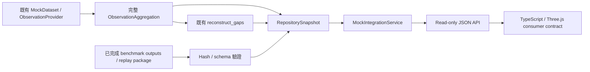

# Phase 2 Integration Foundation / Phase 2 整合基礎

[繁體中文](#繁體中文) | [English](#english)

## 繁體中文

### 授權範圍與 Phase 1 邊界

本文件對應獨立 branch `phase2/integration-foundation`，從 Phase 1 checkpoint
`b11edb9d6157699d395c112298f8fab518f202a6` 建立。2026-10-02 的使用者授權僅涵蓋
既有 fake/mock data 的 Integration Foundation；這不是 Phase 1 研究驗收，亦不將
[PRD](PRD.md) 的完整產品 backlog 提升為本輪需求。
後續獨立 branch 的 portability／stress 結果見
[Phase 2 Integration Hardening](PHASE2_INTEGRATION_HARDENING.md)。

Graph Engine、Top-K、Reconstruction、Metrics、benchmark runner、domain schemas、
既有 fixtures、dependencies／lock 與 Blender assets 均沿用 Phase 1。Integration Foundation
以 composition 保存原始 contracts，不繼承或改寫 Phase 1 schema。
若後續整合需要改動 Phase 1 contract，停止該部分並先回報原因。

本輪排除 Real CV、正式 Detection／Tracking、ReID、正式 Vector DB、PostgreSQL deployment、
高併發 load test、Agent Semantic Ranking、Blender semantic geometry modification 與
Phase 1 benchmark logic modification。完成後不 merge 回 Phase 1；目前只有本機 commits。

### 模組與實作狀態

| 模組 | 責任 | 狀態 |
| --- | --- | --- |
| `integration/contracts.py` | Versioned requests/responses、BackendAPI Protocol、JSON Schema | Contract／interface |
| `integration/repositories.py` | Canonical snapshot、IntegrationRepository、PostgreSQL factory/settings | Contract／interface；沒有 SQL driver |
| `integration/local_repository.py` | Memory 與 atomic local JSON snapshot | Synthetic mock implementations，單一 writer |
| `integration/config.py`、`wiring.py` | Producer/storage config、既有 MockDataset/ObservationProvider wiring | Mock composition root |
| `integration/service.py` | Observation/Event overlap queries、Trajectory／consumer／replay reads | Mock service |
| `integration/api.py`、`__main__.py` | Read-only JSON/WSGI transport、schema export、loopback CLI | 可執行 mock API |
| `integration/replay.py` | 驗證並讀取既有 [Phase 1 benchmark outputs](BENCHMARK.md)、定位原 replay config | 本機 read-only adapter |
| `integration/consumer.py` | Lossless ConsumerEvent、全部 alternatives 的 display replay markers | Consumer contract 與 presentation helper |
| `frontend/phase2/contracts.ts`、`consumer.ts` | Readonly TypeScript schemas、runtime validator、API key helper | Three.js consumer foundation；沒有 UI app／renderer |
| `configs/integration/mock_v1.json` | 綁定既有 stream_v1 manifest 的 SHA-256 | Mock configuration |

PostgreSQL 只有 `PostgreSQLRepositoryFactory.open(settings) -> IntegrationRepository`；DSN
使用 `SecretStr`，沒有 connection、migration、transaction implementation 或 deployment。
Service config 選擇 `POSTGRESQL` 會明確拋出 `NotImplementedError`，不 fallback 到另一個 store。
既有 Phase 1 `EventRepository.save/get` 介面不變；新增 snapshot port 同時保存外層 binding，
不把 bare Event 假裝成完整的來源綁定紀錄。

### 資料流與服務責任



`build_mock_service` 驗證 manifest hash、使用原 `load_dataset_case`，在完整 provider time range
上以指定 aggregation policy 聚合；每個 case 呼叫原 `reconstruct_gaps`，保留 dataset seed、
case ID、pipeline policies 與 source/context binding。GET request 只讀 snapshot，不重跑 inference。
服務不載入 evaluation reference geometry，也不讀 metrics 來選路或排序。

`RepositorySnapshot` 保存完整 `BoundObservation` 與 `BoundGapEvent`。每個 gap 的兩端必須
精確等於所存 observations，包括 sample IDs、來源與 context。相同 ID／相同 payload 重複新增
是 idempotent；相同 ID／不同 payload 拒絕，整批 merge 在驗證完成後才發布。
Local JSON 每次讀取重新驗證磁碟內容，使用既有 atomic JSON writer；不承諾多 writer、DB
transactions 或高併發能力。Composition root 禁止 repository path 覆寫 declared inputs。

### Query、API 與識別碼

時間維持 **非負 configured synthetic seconds**；query／seek 邊界都是 closed/inclusive
`[start, end]`，允許 point query。Stored Observation/Event query 使用區間 overlap，回傳完整
canonical records，不截斷、重建 ID 或改寫時間。可依 camera、target、source、spatial context
篩選；Event 的 camera filter 指兩個 endpoint cameras。排序穩定，候選／hypothesis 內部順序
完全照 Phase 1 保存；目前回傳全部符合資料，沒有 pagination 或 production 查詢效能宣稱。

原 `ObservationProvider.get_observations` 仍依所選 raw sample window 重新聚合。窄 window
可能產生不同的 content-derived Observation ID；需透過 `observation_provider`／
`provider_observations` 使用此原始行為。Event joins 使用已保存的完整 observations，不能以
gap window 的 provider 重查結果取代 canonical endpoints。

| GET 路由 | 輸入／輸出 |
| --- | --- |
| `/v1/contract` | `ApiContract`，包含每個 advertised request/response 的 JSON Schema |
| `/v1/observations` | 必填 `start`／`end`；選填四種 ID filter；`ObservationPage` |
| `/v1/events` | 相同 query 格式；`EventPage` |
| `/v1/events/{event_key}` | `EventResponse`，包含原 `BoundGapEvent` |
| `/v1/events/{event_key}/trajectories` | 全部 Candidates／Hypotheses、termination reason、complete |
| `/v1/events/{event_key}/consumer` | Lossless `ConsumerEvent` |
| `/v1/events/{event_key}/replay?timestamp=...` | `ReplayFrame`，保留全部 alternatives 的 markers |

`event_key = "e-" + base64url(UTF-8 event_id)`，移除 padding。Python `encode_event_key` 與
TypeScript `eventPath` 共用此契約；原 Event ID 不變，含 `/`、`%`、Unicode 的合法 ID 亦能
查詢。WSGI 不對此 key 再做 URL decode；非 canonical key／invalid query 回 400，未知 Event
或路由回 404，非 GET 回 405。API 是 mock transport，沒有 production authentication/server。

### Three.js 與 replay

世界座標保留 **Blender right-handed XYZ、Z up、metres**。Three.js consumer 使用
`Object3D.DEFAULT_UP.set(0, 0, 1)` 與 `camera.up.set(0, 0, 1)`，直接複製原 XYZ；不得以
navigation anchors 宣稱 calibrated camera poses 或 FOV。`OBSERVED`、`PROJECTED`、
`INFERRED_GAP` 需可區辨，不能把 inferred routes 呈現為 Ground Truth 或唯一已確認路徑。

`ConsumerEvent.gap` 完整保存 Phase 1 payload、nullable fields、candidate/hypothesis ordering、
uncertainty、termination 與 `search_result.complete`。`complete` 仍表示 configured bounded
search exhausted，不能用來表示 HTTP request 成功。沒有新增 probability、score 或 ranking。

Replay seek 在原 keyframe 時保留其座標與 provenance；中間時間只對顯示 marker 線性插值，
標記 `interpolated=true`／`INFERRED_GAP`，不改寫 Event／hypothesis／metrics。回傳所有
hypotheses；超出 Event 或任一 hypothesis extent 拒絕，不外推。`NO_FEASIBLE_PATH` 保留空
candidates／markers；其他空結果亦保留原 termination reason 與 `complete`。

`load_benchmark_snapshot` 要求原 `artifacts.json` 為 COMPLETE/version 1.0，驗證所有列出檔案
的 size／SHA-256、root containment、duplicate/alias paths 與 observations/candidates coverage。
它保留已驗證 inference bytes 後才解析 `ObservationAggregation`／`BoundGapEvent`，驗證完成
前不寫 repository。Metrics、GT、source patch／lock 與原 `replay/config.json` 只做完整性驗證；
不解析為 inference input。Manifest hashes 表示 package 內部一致性，不代表外部權威認證。
`load_replay_config` 回傳已驗證 locator，不執行 benchmark；原 portable replay 格式維持不變。

### 本機使用與驗證入口

```sh
uv run python -m amidst.integration --config configs/integration/mock_v1.json --contract
uv run python -m amidst.integration --config configs/integration/mock_v1.json
uv run python -m amidst.integration --config configs/integration/mock_v1.json --serve --port 8000
uv run python -m amidst.integration --benchmark-output /path/to/completed/benchmark
uv run pytest tests/integration/test_phase2_integration.py
uv run pytest tests/unit/test_phase2_*.py
uv run pytest
uv run ruff check .
uv run mypy
git diff --check
```

預設 memory repository；LOCAL_JSON 的 `repository_path` 相對 service config 所在檔案解析。
CLI server 只綁定 `127.0.0.1`，不啟動 production deployment。TypeScript runtime coverage 使用
支援 native type stripping 的 Node；本輪以 Node 26 執行，未新增 TypeScript／Three.js dependencies。
完整 Blender-backed pytest 需要在可正常啟動 Blender 的環境執行，不需要 render／save assets。
[Phase 2 Integration Validation 整合驗證與凍結](PHASE2_INTEGRATION_VALIDATION.md)
保存本階段結果；日期與 checkpoint 綁定的歷史紀錄見 [WORK_LOG](WORK_LOG.md)，續作入口見
[CODEX_HANDOFF](CODEX_HANDOFF.md)。

## English

### Scope and implementation boundary

`phase2/integration-foundation` starts from Phase 1 commit
`b11edb9d6157699d395c112298f8fab518f202a6`. The 2026-10-02 authorization covers synthetic/mock
integration only. Phase 1 Graph, Top-K, Reconstruction, Metrics, benchmark logic, domain schemas,
fixtures, dependencies/lock and Blender assets remain unchanged. Any required Phase 1 contract
change must stop for a report before implementation. This branch is not merged into Phase 1.

Real CV, production Detection/Tracking, ReID, production Vector DB, PostgreSQL deployment,
high-concurrency load tests, Agent Semantic Ranking and Blender semantic geometry changes remain
excluded. This foundation does not certify Phase 1 research acceptance or a school dataset.

Subsequent work on the separate hardening branch is recorded in
[Phase 2 Integration Hardening](PHASE2_INTEGRATION_HARDENING.md).

### Additive architecture

`src/amidst/integration/` contains the versioned backend schemas/Protocol, snapshot repository port,
mock memory/local JSON stores, config/composition root, mock query service, read-only WSGI/CLI,
verified [Phase 1 benchmark](BENCHMARK.md) importer and lossless presentation/replay envelopes.
`frontend/phase2/contracts.ts` defines readonly consumer interfaces; `consumer.ts` validates runtime
payloads and supplies event-route encoding. There is no UI app or Three.js renderer.

`PostgreSQLRepositoryFactory.open(settings) -> IntegrationRepository` and secret DSN settings are
interfaces only. Selecting POSTGRESQL in service config raises `NotImplementedError`; there is no
driver, migration, connection or deployment. The Phase 1 bare EventRepository interface is unchanged;
the new port retains complete bound records rather than dropping source/context identity.

Mock composition uses the existing content-bound `load_dataset_case`, MockDataset/ObservationProvider,
full-case aggregation and unchanged `reconstruct_gaps`. API reads never rerun inference or deserialize
evaluation geometry. Snapshots require unique immutable IDs and exact stored endpoints. Identical
inserts are idempotent; conflicting IDs fail before publication. Local JSON revalidates disk contents
and uses atomic single-writer publication, with no cross-process transaction/concurrency claim.

### Contract semantics and replay

Time is nonnegative configured synthetic seconds, with closed inclusive query/seek boundaries.
Stored queries select overlapping complete records; provider window queries retain their original
reaggregation behavior and can produce different Observation IDs. Event joins always use canonical
stored endpoints. Optional camera/target/source/context filters and stable record order never alter
the supplied candidate/hypothesis order. No pagination is implemented.

The seven GET routes are listed in the Traditional Chinese section above and exported by
`/v1/contract`, including every request/response JSON Schema. Route keys are `e-` plus unpadded
base64url UTF-8 Event IDs, using Python `encode_event_key` or TypeScript `eventPath`. This preserves
literal slashes, percent signs and Unicode identities without additional WSGI URL decoding.
Invalid requests return 400, unknown records/routes 404, and write methods 405.

ConsumerEvent preserves the complete BoundGapEvent, IDs, bindings, nullable fields, provenance,
uncertainty, candidate/timing alternatives, termination and exhaustive-search completeness. Blender
right-handed XYZ, Z up and metres remain intact; configure Three.js up vectors to `(0, 0, 1)`.
Do not equate camera navigation anchors with calibrated poses/FOV or select a truth-based winner.

Replay returns every hypothesis marker in existing order. Exact keyframes retain original provenance;
interior display interpolation is explicitly INFERRED_GAP and never modifies inference records.
Out-of-extent seeks fail; empty/no-feasible and incomplete search states retain their original meaning.

The read-only importer requires the original COMPLETE/version-1.0 artifacts manifest, verifies all
sizes/hashes, contained canonical paths, uniqueness and inference-file coverage, and caches verified
inference bytes before schema loading. Only ObservationAggregation and BoundGapEvent are deserialized.
Evaluation/GT and portable replay/source artifacts are checked for integrity, not fed into inference.
Manifest consistency is not external authenticity. The original replay package remains compatible;
the locator helper neither executes the benchmark nor promises immutable files after lookup.

Use the CLI/check commands above. Config chooses MEMORY by default; LOCAL_JSON paths are relative
to the service config. Optional serving binds only loopback. Node native type stripping runs the
TypeScript contract tests without new dependencies. See
[Phase 2 Integration Validation and freeze](PHASE2_INTEGRATION_VALIDATION.md) for this stage;
dated history is in [WORK_LOG](WORK_LOG.md);
current ownership/scope is in [CODEX_HANDOFF](CODEX_HANDOFF.md).
