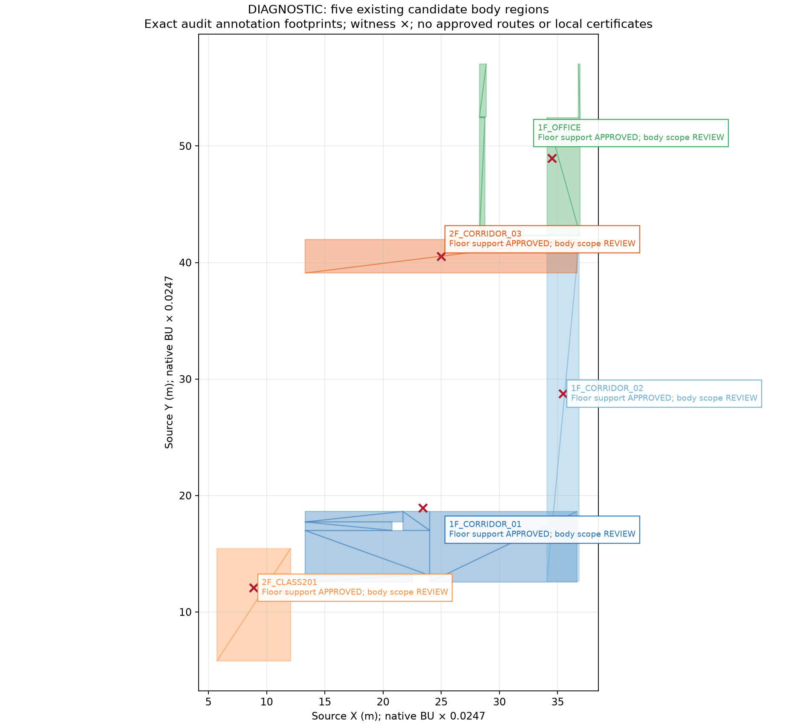
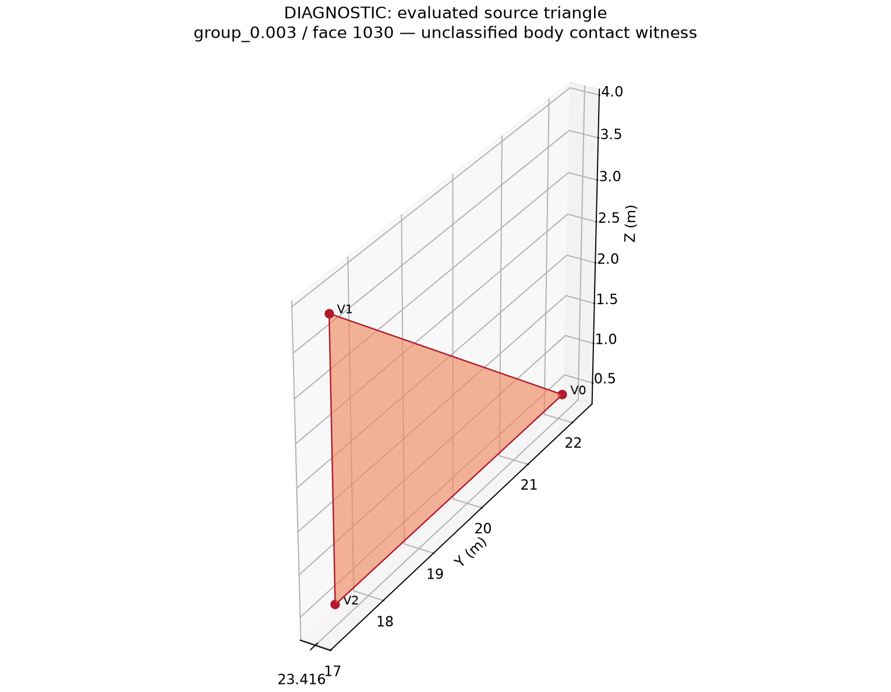

# Phase 1 Finalization: one human review gate / 單一人工 gate

**Status: BLOCKED / DIAGNOSTIC.** Gate ID:
`PHASE1-FINALIZATION-LOCAL-AUTHORITY-AND-FORMAL-SETTINGS`.
This package identifies only prerequisites for formal Case 1–3. It does not ask for
building-wide cleanup, 1,422 WALL reviews, the eight unrelated portal conflicts or
Stair A/B approval. Case 4 remains DEFERRED.

## 繁體中文

目前可保留的核准範圍：architectural scale **1 BU = 0.0247 m**；upright cylinder
radius 0.30 m / height 1.70 m / body clearance 0.05 m；portal 每側 0.05 m、垂直
0.10 m、contact tolerance 0.001 m；48 個 actual source-supported WALKABLE 子域；
5/19 obstacles 中 58 個 source-bound closed components。這些 approvals 沒有核准
整個空間的 body / ceiling clearance、完整 collider ownership 或 route connectivity。

[gate.json](gate.json) 集中記錄以下最低必要缺口；可用同一次 review 填完，不需分散
審查。K=1/2/3 已由本 Sprint 明定，不要求重新批准。

| 必要項目 | 現況與確切原因 | 完成此 gate 所需資料 |
| --- | --- | --- |
| 限定 domain 的 geometry semantics | 既有 `local_physical_scopes.json` 的 approved scope count=0，五區 certificate 全為 null。共同 witness 是 `group_0 / component-00000000` 的 surface / solid interior ownership 不明。 | 選擇限定 review domain，僅決定該域相關 source faces 的 surface / solid ownership，或授權可追溯 derived geometry 修正。不要求批准整個 `group_0` component；clearance 與 certificate 由程式重跑。 |
| Camera / landmark / floor semantic binding | 既有 pilot calibration / plane 是 diagnostic binding，觀測的是 elevated landmark；它與正式 floor-contact trajectory 的語意關係尚未批准。 | 確認限定 domain、現有 source-bound cameras 所觀測的 landmark 定義與 floor/contact-plane 關係。Calibration、endpoint access、topology、route inventory 與 timing feasibility 由程式核對，不要求人工計算。 |
| 正式 MetricConfig | [protocol_v1.json](../configs/benchmarks/protocol_v1.json) 的 formal Coverage D / epsilon、alignment / interpolation / reference sampling 仍為 null / UNRESOLVED_RESEARCH_SETTING。不能拿 synthetic 或 historical pilot epsilon 當正式設定。 | 在正式 benchmark 前宣告 Coverage D、strictly positive epsilon（m）及已支援的 sampling / alignment / interpolation policy，版本化並鎖 hash。本 package 不提出任意 epsilon。 |

只提供四種選項：

- **APPROVE**：批准填妥、source-bound 的限定 scope / binding / settings payload。
  幾何仍須通過原有 exact certificate 與 Sprint Exit Gate。未提供必要 payload 的
  APPROVE 不等於完整局部 geometry 認證。
- **REJECT**：排除所審限定 domain 或設定；保留已有核准證據，再找獨立可認證的 replacement。
- **FIX_GEOMETRY**：批准另行規劃可追溯 derived geometry / evidence 修正；原始
  `school_v3.blend` 保持不可修改。先生成、核對 bindings 與重新驗證，再決定 approval。
- **KEEP_REVIEW**：保持此 gate pending，保留已完成且不依賴它的工作；正式 Cases 1–3
  與 freeze 維持 blocked。

人工只決定以上局部 geometry / landmark semantics 與正式研究容差。語意決定後，
agent 會計算 source / calibration hashes、floor containment、full-body clearance、
local certificate、可達端點、Case 1 route uniqueness、Case 2 branch count、可行 route
inventory、Case 3 speed / time feasibility 與 timing hypotheses，建立獨立 simulation /
evaluation movement / dwell annotations，再鎖定正式 input version。這些可由程式判斷的
結果不要求人工提供；任何未通過的項目繼續 REVIEW，APPROVE 不會覆蓋幾何失敗。

### 已有局部定位證據

以下為既有搜尋候選，不是已批准 routes。每區 floor support 均 APPROVED / whole
annotation supported，但完整 body scope REVIEW / certificate=null。搜尋每區 180 個
windows（half extents 2 / 1 / 0.5 m），不是 exhaustive school geometry search。
[gate.json](gate.json) 保存 floor、AREA（若已宣告）、source object / evaluated polygon
face index、BU 與 meter coordinates。這些 limited-domain witnesses 沒有要求穿越 PORTAL，
因此 portal=null；不能把另外八個門洞衝突列成這次必要 review。

| Floor / candidate | AREA binding | Source object / face or component | Issue |
| --- | --- | --- | --- |
| 1F / WALK_1F_CORRIDOR_01 | 未提供 source-area binding | group_0.003 / face 1030；face 1308；group_0 / component-00000000 | unclassified body contact；degenerate context triangle；unknown solid interior |
| 1F / WALK_1F_CORRIDOR_02 | 未提供 source-area binding | group_0 / component-00000000 | unknown solid interior |
| 1F / WALK_1F_OFFICE | AREA_1F_OFFICE | group_0 / face 1975；component-00000000 | degenerate context triangle；unknown solid interior |
| 2F / WALK_2F_CLASS201 | AREA_2F_CLASS201 | group_0 / face 11380；component-00000000 | body clearance 約 0.03548 m，低於 0.05 m；unknown solid interior |
| 2F / WALK_2F_CORRIDOR_03 | 未提供 source-area binding | group_0 / component-00000000 | unknown solid interior |

共同 component topology：17,596 triangles、1,456 degenerate triangles、11,635
nonmanifold edges、boundary edges=0、closed consistent nonzero volume=false。
這是定位共同 blocker 的背景證據，不要求人工批准整個 component。不能由名稱自行將
`group_0` 解釋成 WALL，也不能批次忽略退化 geometry。

Case 1 需要獨立確認唯一可行路徑；Case 2 需要獨立確認兩至三條分歧路徑；Case 3
需要相同路徑 authority 加時間 / 速度政策。Floor contact approval 與 unknown free-space
狀態不能代替上述證明。Physical metric 允許 N/A / NOT_CERTIFIED；這項缺失仍不能被記為 PASS。

### Preview 與 source 定位

PNG 為 **DIAGNOSTIC exact-evidence geometry preview**，不是 Blender screenshot 或正式
scene render。XY 圖使用 committed semantic audit 的原始 annotation vertices / triangles，
紅叉取自實際 review witnesses；annotation footprint 不代表 collider。3D 圖只畫原有
`group_0.003` evaluated face 1030 的三個 source triangle vertices，未生成 building geometry
或 body mockup。Blender 定位時使用下列座標與 object / evaluated polygon index；若 modifiers
改變 topology，原始 mesh face index 不可直接代替 evaluated index。

Face 1030 triangle（BU → m）：

| Vertex | BU (X, Y, Z) | m (X, Y, Z) |
| --- | --- | --- |
| V0 | 948.012237549, 894.029678345, 20.078849792 | 23.415902267, 22.082533055, 0.495947590 |
| V1 | 948.012237549, 703.101882935, 153.937103271 | 23.415902267, 17.366616509, 3.802246451 |
| V2 | 948.012237549, 703.101882935, 20.078849792 | 23.415902267, 17.366616509, 0.495947590 |

Corridor 02 enclosure witness：BU `(1435.643066406, 1163.148320366, 54.491805258)`；
m `(35.460383740, 28.729763513, 1.345947590)`。
這是 certification body-envelope witness location，**不是 GT trajectory 或已核准 footpoint**。

## English

Only one consolidated gate is pending. Scale, the body policy, 48 supported floor
subdomains and 58 exact obstacle components retain their existing approval. No complete
local physical certificate exists. Shared `group_0 / component-00000000` has uncertain
surface/solid ownership; some sampled windows also encounter unclassified contact,
insufficient clearance or degenerate source triangles. Floor support cannot establish
unique, branched or long-gap route feasibility.

Decide only local source-face surface/solid semantics or authorize a traceable derived
geometry correction, confirm the observed landmark/floor semantic binding, and declare
the formal research tolerance. No whole-component approval or manually computed route
inventory is requested. After those semantic decisions, the agent computes calibration,
clearance, certificates, endpoint access, route uniqueness/branch counts, feasible-route
inventory and speed/time feasibility, then freezes the formal inputs.
The committed protocol still has null Coverage distance/epsilon and sampling/alignment/
interpolation fields. K=[1,2,3] is already explicitly requested. This package proposes no
new epsilon or route geometry.

The four choices are **APPROVE**, **REJECT**, **FIX_GEOMETRY**, and **KEEP_REVIEW**.
APPROVE accepts only a complete bounded payload; programmatic geometry certification
and all finalization exit gates must still pass. REJECT excludes the reviewed proposal.
FIX_GEOMETRY authorizes a separate traceable derived-geometry plan while preserving the
original scene. KEEP_REVIEW leaves formal Cases 1–3 and freeze blocked.

The previews use exact committed source witness and annotation coordinates. They are
diagnostic geometry plots, not Blender screenshots, navigation proofs or invented
building geometry. No global WALL, unrelated portal or stair review is requested.

## Provenance / 重建

- Physical baseline: `f264db1579882e54cecba22db24ec8798822fd0c`.
- Projection baseline: `8f4055ffcdc3bf6efd723c7956ac685e1fe033f1`.
- Source `school_v3.blend`: SHA-256
  `cd46fa03f1875145a047e7e5f882aa97e7b2376de637677bf083bdc671e6e84e`,
  468,300,506 bytes. Verified read-only against the canonical local scene.
- Native source preserved; no Blender open/save/render is required by this package.
- [manifest.json](manifest.json) binds input and generated preview hashes.
- Run `uv run python human_review/build_review.py` from the repository root. Matplotlib is
  required for previews; generation reads committed evidence and writes only this folder.
- Full raw physical evidence: [materialization guide](../docs/PHYSICAL_EVIDENCE_MATERIALIZATION.md).
- Source authority: [authority.md](../data/scene_audit/phase1_physical_policy_approval_20261006/authority.md).
- Full scope witnesses: [local_physical_scopes.json](../data/scene_audit/phase1_physical_policy_approval_20261006/local_physical_scopes.json).
- Case definitions and metric semantics: [benchmark protocol](../docs/PHASE1_BENCHMARK_PROTOCOL.md).
